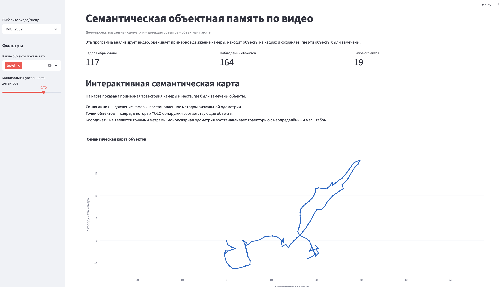
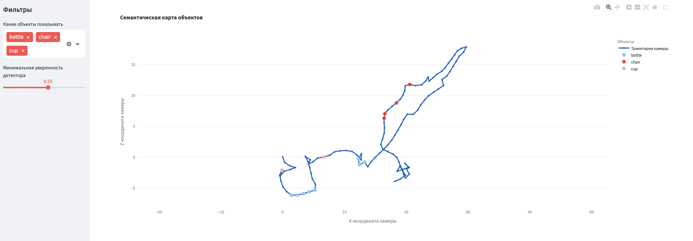
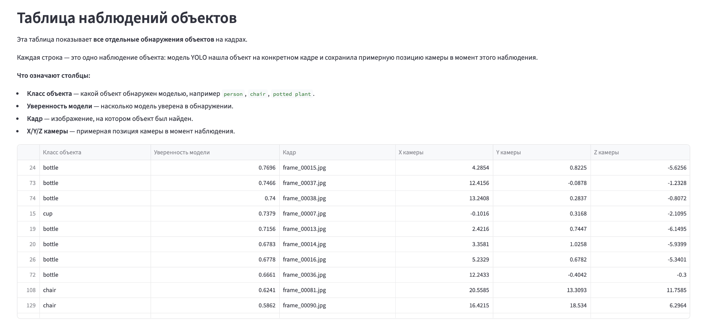
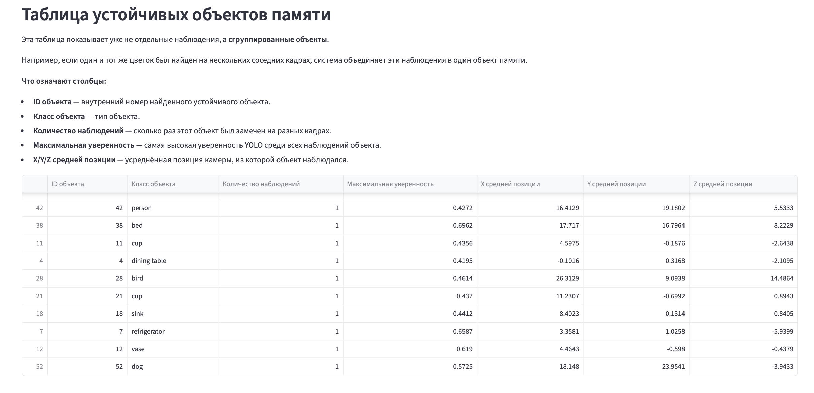
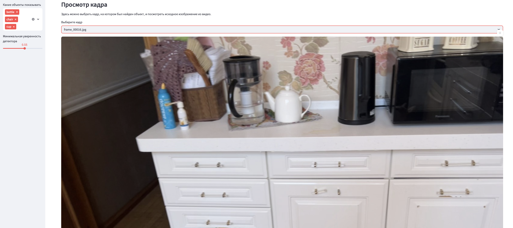

# Semantic Object Memory SLAM

Проект для построения семантической объектной памяти по видеопотоку.

Система анализирует видео, обнаруживает объекты на кадрах, оценивает траекторию движения камеры и формирует семантическую карту наблюдаемых объектов. Для визуализации результатов реализован интерактивный веб-интерфейс на Streamlit.

---

## Основные возможности

* извлечение кадров из видео;
* обнаружение объектов с помощью YOLOv8;
* оценка траектории камеры методом монокулярной визуальной одометрии;
* построение объектной памяти;
* группировка повторных наблюдений одного объекта;
* построение семантической карты сцены;
* визуализация результатов в браузере.

---

## Архитектура проекта

```text
Видео
  ↓
Извлечение кадров
  ↓
YOLOv8 Object Detection
  ↓
Visual Odometry (ORB + Essential Matrix)
  ↓
Object Memory
  ↓
Object Identity Grouping
  ↓
Semantic Map
  ↓
Streamlit Web Interface
```

---
## Результаты работы веб-сервиса










---

## Используемые технологии

* Python
* OpenCV
* YOLOv8
* NumPy
* Pandas
* Matplotlib
* Plotly
* Streamlit

---

## Установка

```bash

cd semantic-object-memory-slam

python3 -m venv venv
source venv/bin/activate

pip install -r requirements.txt
```

---

## Запуск обработки видео

Поместите видеофайл в папку `data`.

Запустите обработку:

```bash
python src/run_video.py
```

После завершения результаты будут сохранены в папке:

```text
runs/
└── example/
    ├── frames/
    └── outputs/
        ├── detections.json
        ├── poses.json
        ├── memory.json
        ├── objects.json
        ├── semantic_map.png
        └── object_summary.csv
```

---

## Запуск веб-интерфейса

```bash
streamlit run app.py
```

---

## Ограничения текущей версии

Проект использует монокулярную визуальную одометрию, поэтому восстановленная траектория может содержать накопленную ошибку и неопределённость масштаба.

В текущей реализации координаты объектов соответствуют позиции камеры в момент наблюдения, а не точной 3D-позиции объекта.
